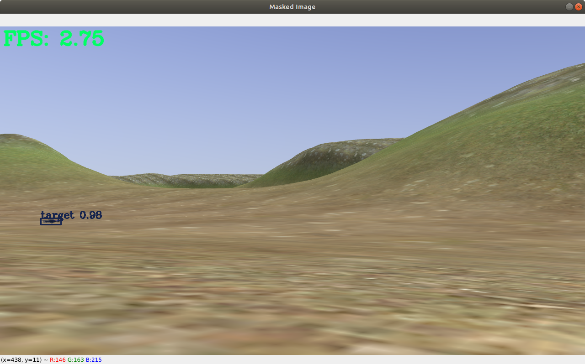
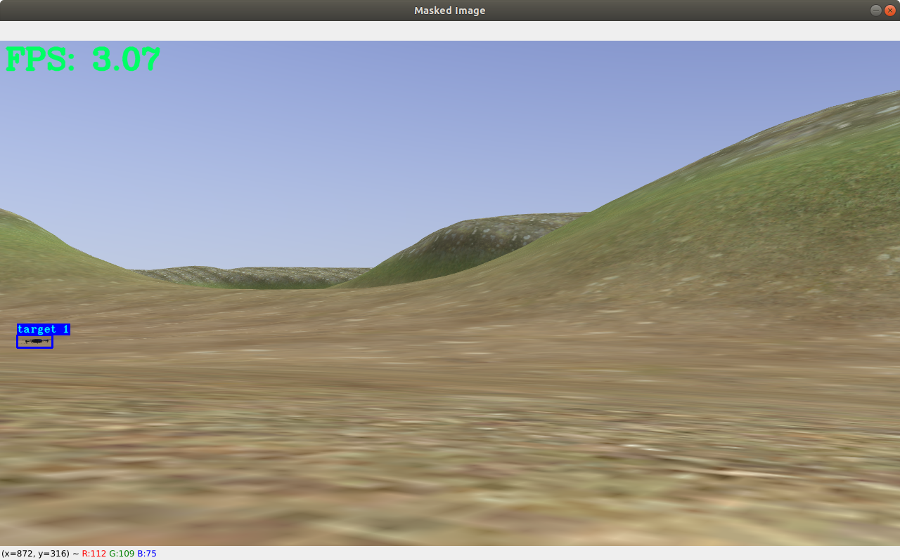

# mask_rcnn_ros

## Prerequisites
---
- Ubuntu LTS 18.04

- ROS Melodic 

- [Setup PX4, QGC and MavROS](https://github.com/dylantzx/PX4)

- JupyterLab

- Anaconda3

- Python 3.7+

- TensorFlow-gpu 2.5.0

- Keras 2.3.0

- Numpy, skimage, scipy, Pillow, cython, h5py

- NVIDIA Drivers 

- CUDA 11.3

- CuDNN 

## About
---

This is a ROS package of [Mask RCNN](https://github.com/akTwelve/Mask_RCNN) with [DeepSORT](https://github.com/nwojke/deep_sort) for object detection, instance segmentation and object tracking.

It contains ROS nodes for object detection and object detection with tracking.

The current repository is for a drone tracking another drone on PX4 but you should be able to adapt it for your own use case.

## Installation Guide
---

### NVIDIA Drivers, CUDA and CuDNN 

1. [Guide for NVIDIA Drivers and CuDNN installation](https://docs.nvidia.com/deeplearning/cudnn/install-guide/index.html#installlinux)

2. [Guide for CUDA installation](https://docs.nvidia.com/cuda/cuda-installation-guide-linux/index.html)

### Anaconda3, JupyterLab and Conda environment

1. [Anaconda3 Installation](https://www.anaconda.com/products/individual) 

2. [JupyterLab Installation](https://jupyter.org/)

3. [Conda environment guide](https://conda.io/projects/conda/en/latest/user-guide/tasks/manage-environments.html)

### The rest of the prerequisites ###
Clone the repository then change to the `Mask_RCNN` directory in terminal and use `pip install -r requirements.txt` 
```
cd ~/catkin_ws/src
git clone https://github.com/dylantzx/mask_rcnn_ros.git --recursive
cd mask_rcnn_ros/src/Mask_RCNN
conda activate <your_env>
pip install -r requirements.txt
```

You can also install them individually with `pip install <requirement>` in your virtual environment 

## Getting Started
---

[FPS.py](https://github.com/dylantzx/mask_rcnn_ros/blob/main/src/FPS.py) - Contains a simple FPS class for FPS calculation 

[ImageConverter.py](https://github.com/dylantzx/mask_rcnn_ros/blob/main/src/ImageConverter.py) - Contains ImageConverter class that converts images received via GazeboROS Plugin of `sensor_msgs` type to a usable type for object detection. 

[ObjectTracker.py](https://github.com/dylantzx/mask_rcnn_ros/blob/main/src/ObjectTracker.py) - Contains class to utilize DeepSORT for object tracking.

[mask_rcnn_ros_detect_node.py](https://github.com/dylantzx/mask_rcnn_ros/blob/main/src/mask_rcnn_ros_detect_node.py) - Main script that runs MaskRCNN with ROS for object detection

[mask_rcnn_ros_track_node.py](https://github.com/dylantzx/mask_rcnn_ros/blob/main/src/mask_rcnn_ros_track_node.py) - Main script that runs MaskRCNN with ROS for object detection with tracking.

## How to run codes
---
1. Go into your virtual environment

    ```conda activate <your_env>```

2. To run object detection, run the launch file
    
    ```roslaunch mask_rcnn_ros rcnn_detect.launch```



3. To run object detection with tracking, run the launch file
    
    ```roslaunch mask_rcnn_ros rcnn_track.launch```



## Training MaskRCNN
---

To train Mask_RCNN on your own custom dataset, you can refer to [this website](https://www.immersivelimit.com/tutorials/using-mask-r-cnn-on-custom-coco-like-dataset) and create a jupyter notebook, then place it under the `Mask_RCNN/scripts` directory. 

Similar to the tutorial, place your images for training, validation and testing under `Mask_RCNN/datasets/`

After getting your weights (.h5 extension), place them under the `Mask_RCNN/model_weights` directory.

## Modifying to use it on your own dataset
---

1. Go to `Mask_RCNN/scripts/visualize_cv2.py`.
2. Change the path of `COCO_MODEL_PATH` in line 13 to the name of your weight file.
3. Change the `class_names` in line 53 to your own list of class names
4. If required, change the settings in `InferenceConfig`
5. Go to the launch file that you will be using
6. Remap the `image_topic` to your own ROStopic that is publishing the images

## Evaluation
---
The evaluation script is found in the `Mask_RCNN/evaluation/main.py`.

Change the path and names on lines 30 - 32 into your own.

In your terminal, change directory into `Mask_RCNN/evaluation` and run `python main.py`

Upon successful execution, you should get an excel spreadsheet under `Mask_RCNN/exports/` with your evaluation results.

