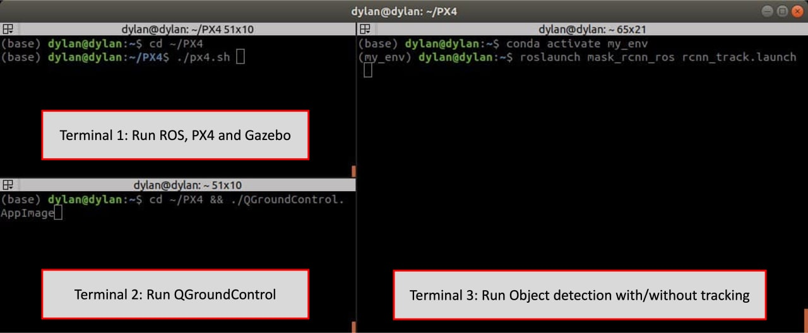
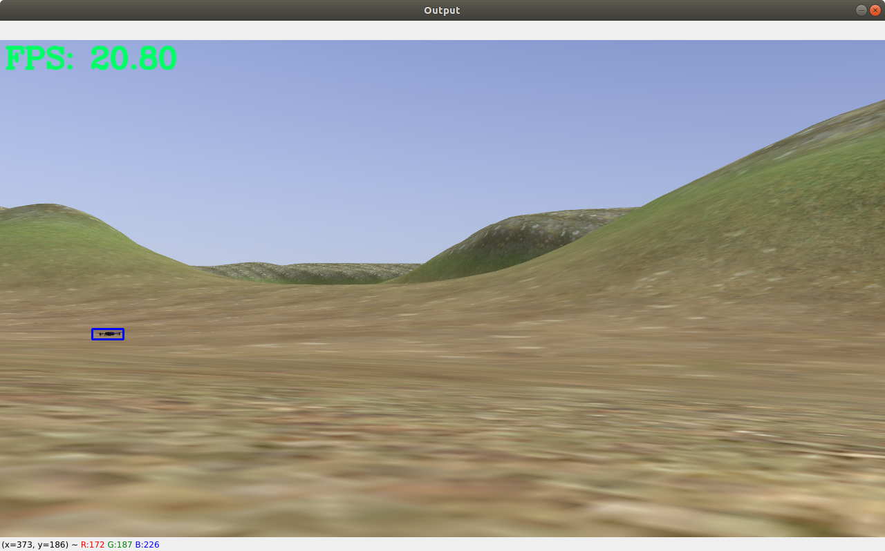
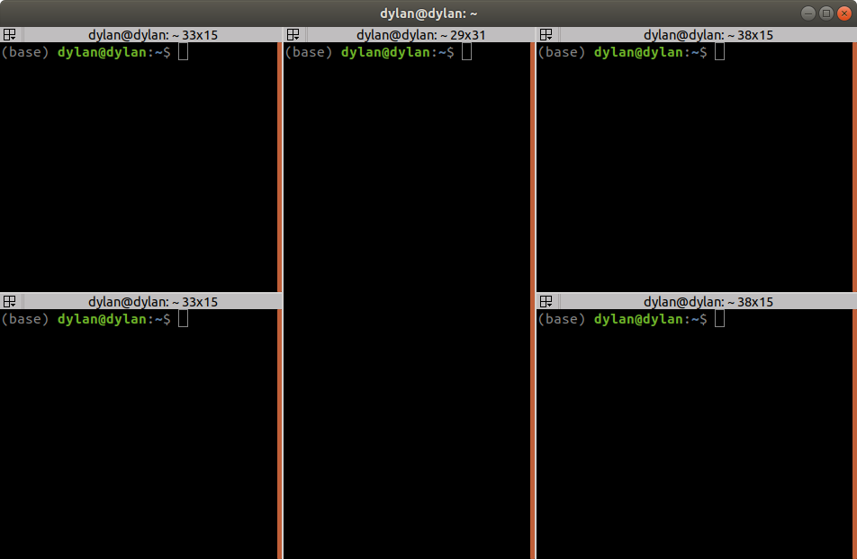

# mask_rcnn_ros

## Prerequisites
---
- Ubuntu LTS 18.04

- ROS Melodic 

- [Setup PX4, QGC and MavROS](https://github.com/dylantzx/PX4)

- JupyterLab

- Anaconda3

- Python 3.7+

- TensorFlow-gpu 2.5.0

- Keras 2.3.0

- Numpy, skimage, scipy, Pillow, cython, h5py

- NVIDIA Drivers 

- CUDA 11.3

- CuDNN 

## About
---

This is a ROS package of [Mask RCNN](https://github.com/akTwelve/Mask_RCNN) with [DeepSORT](https://github.com/nwojke/deep_sort) and [OpenCV Tracking Algorithms](https://learnopencv.com/object-tracking-using-opencv-cpp-python/) for object detection, instance segmentation and object tracking.

It contains ROS nodes for object detection and object detection with tracking.

The current repository is for a drone tracking another drone on PX4 but you should be able to adapt it for your own use case.

Currently, the implementation of Object Tracking using DeepSORT  does not work that well but the implementation of Object Tracking using CSRT Tracker works quite decently.   

## Installation Guide
---

### NVIDIA Drivers, CUDA and CuDNN 

1. [Guide for NVIDIA Drivers and CuDNN installation](https://docs.nvidia.com/deeplearning/cudnn/install-guide/index.html#installlinux)

2. [Guide for CUDA installation](https://docs.nvidia.com/cuda/cuda-installation-guide-linux/index.html)

### Anaconda3, JupyterLab and Conda environment

1. [Anaconda3 Installation](https://www.anaconda.com/products/individual) 

2. [JupyterLab Installation](https://jupyter.org/)

3. [Conda environment guide](https://conda.io/projects/conda/en/latest/user-guide/tasks/manage-environments.html)

### The rest of the prerequisites ###
Clone the repository then go to the `Mask_RCNN` directory in terminal and use `pip install -r requirements.txt` 
```
cd ~/catkin_ws/src
git clone https://github.com/dylantzx/mask_rcnn_ros.git --recursive
cd mask_rcnn_ros/src/Mask_RCNN
conda activate <your_env>
pip install -r requirements.txt
```

You can also install them individually with `pip install <requirement>` in your virtual environment 

## Getting Started
---

**Functions:**

[FPS.py](https://github.com/dylantzx/mask_rcnn_ros/blob/main/src/functions/FPS.py) - Contains a simple FPS class for FPS calculation 

[ImageConverter.py](https://github.com/dylantzx/mask_rcnn_ros/blob/main/src/functions/ImageConverter.py) - Contains ImageConverter class that converts images received via GazeboROS Plugin of `sensor_msgs` type, to a usable type for object detection and tracking. 

[DSObjectTracker.py](https://github.com/dylantzx/mask_rcnn_ros/blob/main/src/functions/DSObjectTracker.py) - Contains class to utilize DeepSORT for object tracking.

[ExtraFunctions.py](https://github.com/dylantzx/mask_rcnn_ros/blob/main/src/functions/ExtraFunctions.py) - Includes a method to format bbox and crop detected images for [cosine metric learning](https://github.com/nwojke/cosine_metric_learning)

**Nodes:**

[detect_node.py](https://github.com/dylantzx/mask_rcnn_ros/blob/main/src/detect_node.py) - Main script that runs MaskRCNN with ROS for object detection in real-time.

[track_DS_node.py](https://github.com/dylantzx/mask_rcnn_ros/blob/main/src/track_DS_node.py) - Main script that runs MaskRCNN with ROS for object detection with DeepSORT tracking in real-time.

[track_CSRT_node.py](https://github.com/dylantzx/mask_rcnn_ros/blob/main/src/track_CSRT_node.py) - Main script that runs MaskRCNN with ROS for object detection with CSRT tracking in real-time.

[track_CSRT_mt_node.py](https://github.com/dylantzx/mask_rcnn_ros/blob/main/src/track_CSRT_mt_node.py) - Main script that runs MaskRCNN with ROS for object detection with CSRT tracking, in a multi-threaded approach in real-time.

**Scripts:**

[track_DS.py](https://github.com/dylantzx/mask_rcnn_ros/blob/main/src/track_DS.py) - Script runs MaskRCNN for object detection with DeepSORT tracking on a video.

[track_CV.py](https://github.com/dylantzx/mask_rcnn_ros/blob/main/src/track_CV.py) - Script runs MaskRCNN for object detection with CV tracking methods on a video.

[track_CSRT_mt.py](https://github.com/dylantzx/mask_rcnn_ros/blob/main/src/track_CSRT_mt.py) - Script runs MaskRCNN for object detection with multi-threaded CSRT tracking on a video.

## Modifying to use it on your own dataset
---

1. Go to `Mask_RCNN/scripts/visualize_cv2.py`.
2. Change the path of `ROOT_DIR` and `COCO_MODEL_PATH` in __lines 11 and 13__ into the paths of your own root_dir and weight file.
3. Change the `class_names` in __line 53__ to your own list of class names. 
4. Change the settings in `InferenceConfig` (Optional)
5. If you want to run the **nodes** eg. `track_CSRT_mt_node.py`:
    - Go to the launch file that you will be using under `mask_rcnn_ros/launch/rcnn_<detect/track>.launch`.
    - Change the `type="<node>"` into the node that you want to launch
    - Remap the `image_topic` to your own ROS Topic that is publishing the images.

6. If you want to run the **scripts** eg. `track_CSRT_mt.py`:
    - Go into the file and change the `video_path` and `output_path` in __lines 27 and 28__ into where you want to input and output the videos to.

## How to run in real-time with ROS
---

1. Firstly, run ROS, PX4, Gazebo and QGroundControl as explained in [this PX4 repo](https://github.com/dylantzx/PX4)

2. In separate terminal, go into your virtual environment

    ```conda activate <your_env>```

3. In the same terminal, run the launch file with the following command:

    - For **Object detection only**:
    
        ```roslaunch mask_rcnn_ros rcnn_detect.launch```

    - For **Object detection with tracking**:
        
        ```roslaunch mask_rcnn_ros rcnn_track.launch```

Example:



Upon successful launch, you should be able to something like:



## How to run scripts on videos
---

1. Open terminal, go into your virtual environment

    ```conda activate <your_env>```

2. Change directory:

    ``` cd ~/catkin_ws/src/mask_rcnn_ros/src ```

3. Run `python <script>`. For example:

    ``` python track_CSRT_mt.py```

## Training MaskRCNN
---

To train Mask_RCNN on your own custom dataset, you can refer to [this website](https://www.immersivelimit.com/tutorials/using-mask-r-cnn-on-custom-coco-like-dataset) and create a jupyter notebook, then place it under the `Mask_RCNN/scripts` directory. 

Similar to the tutorial, place your images for training, validation and testing under `Mask_RCNN/datasets/`

After getting your weights (.h5 extension), place them under the `Mask_RCNN/model_weights` directory.

## Evaluation
---
The evaluation script is found in the `Mask_RCNN/evaluation/main.py`.

Change the path and names on __lines 30 - 32__ into your own.

In your terminal, change directory into `Mask_RCNN/evaluation` and run `python main.py`

Upon successful execution, you should get an excel spreadsheet under `Mask_RCNN/exports/` with your evaluation results.

## Extra
---
**1. Terminator**

To make life easier, you can install terminator, an alternative terminal with additional features and functionality

To install, enter these commands:
```
sudo add-apt-repository ppa:gnome-terminator
sudo apt-get update
sudo apt-get install terminator
```
You can open terminator up with `ctrl + alt + t`

To split into multiple terminals, use `ctrl + shift + o` or `ctrl + shift + o`

When you have your desired layout, right click on any terminal, click on **Preferences**, Go to the Layouts tab, add new layout, rename as **default**, click save, then close.

Restart terminator and you should have your desired layout upon startup



**2. Aliases**

With aliases, you can run the programs quicker without having to type out the whole command. Here is how to add aliases:

1. Go to the home directory and open up the .bashrc file
    ```
    cd ~
    gedit .bashrc
    ```
2. Add the following aliases at the bottom of the file
    ```
    # Easier navigation
    alias ..="cd .."
    alias ...="cd ../.."
    alias ....="cd ../../.."
    alias ~="cd ~"
    alias src="source ~/.bashrc"
    alias c="cd ~/catkin_ws && catkin build"
    alias cs="cd ~/catkin_ws/src && source ~/catkin_ws/devel/setup.bash"
    alias brc="gedit ~/.bashrc"

    # PX4
    alias m="cd ~/PX4/PX4-Autopilot && make"
    alias p="cd ~/PX4 && ./px4.sh"
    alias qgc="cd ~/PX4 && ./QGroundControl.AppImage"

    # ROS
    alias rr="rosrun target_following target_following"
    alias mrl="roslaunch mask_rcnn_ros rcnn_track.launch"
    alias yl="roslaunch yolo_ros yolo_track.launch"

    # git commands
    alias st="git status"
    alias add="git add ."
    alias push="git push"

    # virtual env
    alias cnn="conda activate my_env"
    alias yolo="conda activate yolo"
    alias deact="conda deactivate"

    # Monitor GPU utilization
    alias gpu="gpustat --watch -cp"
    ```
3. Restart terminator


Now that you have added these aliases, if you want to run the `px4.sh` shell script, instead of going to the terminal to type `cd ~/PX4 && ./px4.sh`, you can now just type `p` and enter

**3. Visual Code Studio**

You can download VCS so that you can edit/read/write codes more easily. To do so:
1. Go to https://code.visualstudio.com/ and download vcs

2. Open the PX4/PX4-Autopilot folder

3. Install all workspace extension recommendations

**Note: Do not install a newer version of Cmake as the correct version has already been installed**
## References
---
ROS launch file basics:
- https://www.cse.sc.edu/~jokane/agitr/agitr-letter-launch.pdf

Git modules and submodules guide: 
- https://devconnected.com/how-to-add-and-update-git-submodules/

- https://stackoverflow.com/questions/20929336/git-submodule-add-a-git-directory-is-found-locally-issue

Mask RCNN:

- https://github.com/akTwelve/tutorials/blob/master/mask_rcnn/MaskRCNN_TrainAndInference.ipynb

- https://github.com/matterport/Mask_RCNN

DeepSORT:
- https://github.com/nwojke/deep_sort

- https://nanonets.com/blog/object-tracking-deepsort/#deep-sort

- https://drive.google.com/drive/folders/0B6tjyrV1YrHeMVV2UFFXQld6X1E?resourcekey=0-1oM3LfkEMx36X-Qdq3LlxA

- https://medium.com/augmented-startups/deepsort-deep-learning-applied-to-object-tracking-924f59f99104

TensorRT:
- https://towardsdatascience.com/low-precision-inference-with-tensorrt-6eb3cda0730b

- https://github.com/NVIDIA/TensorRT/tree/release/7.0/samples/opensource/sampleUffMaskRCNN

- https://www.ccoderun.ca/programming/doxygen/tensorrt/md_TensorRT_samples_opensource_sampleUffMaskRCNN_README.html

- https://github.com/NVIDIA-AI-IOT/tf_trt_models

Object tracking:
- https://www.pyimagesearch.com/2018/10/29/multi-object-tracking-with-dlib/

- https://www.pyimagesearch.com/2017/02/06/faster-video-file-fps-with-cv2-videocapture-and-opencv/

- https://learnopencv.com/object-tracking-using-opencv-cpp-python/

- https://github.com/tau-adl/Detection_Tracking_JetsonTX2

Multi threading:
- https://www.researchgate.net/figure/Flow-chart-of-the-multi-thread-detection-and-tracking-Detection-thread-provides-new_fig3_319592114

- https://openaccess.thecvf.com/content_ICCV_2017/papers/Fan_Parallel_Tracking_and_ICCV_2017_paper.pdf

Others:
- https://github.com/wookayin/gpustat
